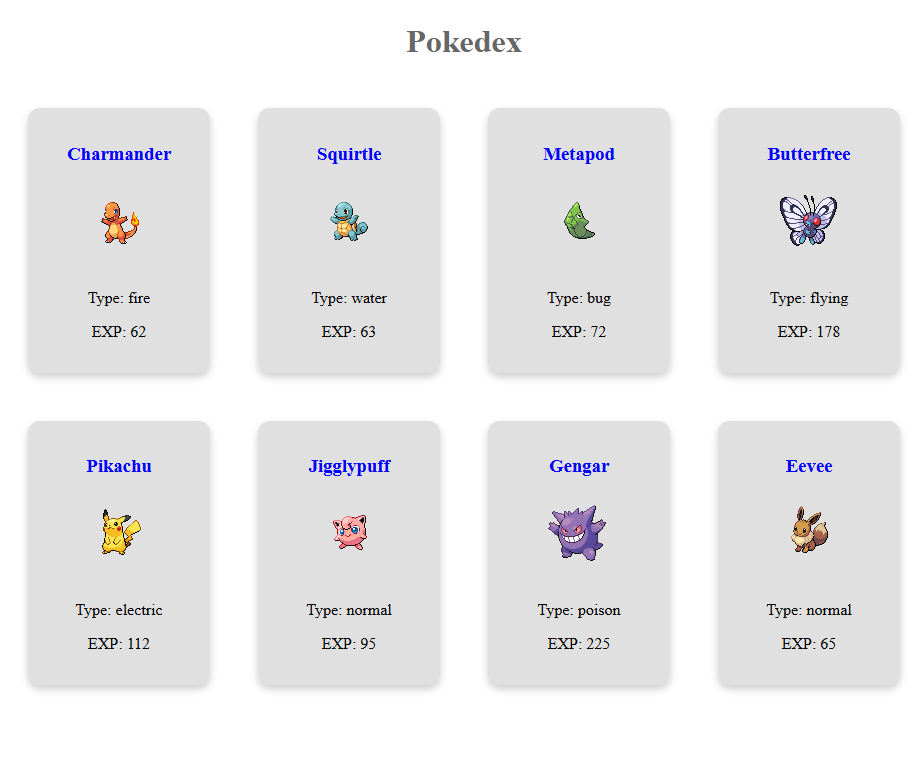

# 📖 Pokedex - React Pokémon Explorer

Pokedex is a simple React application that displays a collection of Pokémon cards with their stats, including type and experience. This project is a part of learning React props, component structuring, and styling.

## 📸 Screenshot
 <!-- Replace with actual image path -->

## 🚀 Features
- **Displays a Grid of Pokémon Cards**: Each card shows a Pokémon’s name, type, and experience.
- **Dynamically Generated Cards**: Uses React components to display Pokémon.
- **Retro Pokémon Styling**: Uses Google Fonts for a classic Game Boy aesthetic.
- **Reusable Components**: Built using modular React components.

## 🛠️ Technologies Used
- React (with Vite)
- JavaScript (ES6)
- CSS (Custom Styling)
- Google Fonts (`Press Start 2P`)
- Pokémon API Sprites

## 📂 Project Structure
